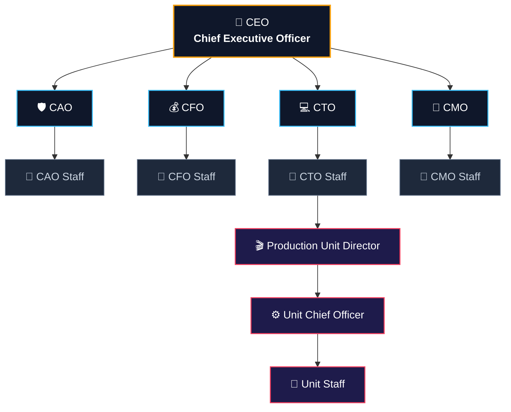

# Dokumentasi Spesifikasi & Refaktor `DesignStructure.tsx`
> **Project:** Corporate Web PT Sinemus Indonesia 
> **Target Style:** Premium Dark Glassmorphism, Modern Executive Minimalist, Interactive Tree/Card Flow.

---

## 1. Overview & Hirarki Tim (Team Structure Data)

Komponen `DesignStructure.tsx` menampilkan tata kelola kepemimpinan dan manajerial Sinemus dalam 4 tingkat hirarki utama.
# 🏢 Team Structure Architecture

---

## 1. Interactive Flowchart (Mermaid.js)

---

## 2. Rincian & Penjelasan Singkat Tiap Direksi / Peran

### 👑 Level 1 — Top Executive

#### `CEO` — Chief Executive Officer *(Pengarah Visi)*
* **Role Badge:** `Level 1 - Executive`
* **Deskripsi:** Pemimpin utama yang menentukan arah strategis, visi jangka panjang, ekspansi bisnis, dan ekosistem platform Sinemus.
* **Fokus Utama:** Inovasi, Kemitraan Strategis, Kepemimpinan Eksekutif.

---

### 🛡️ Level 2 — C-Suite Officers

#### 1. `CAO` — Chief Administrative Officer
* **Role Badge:** `Level 2 - Administration`
* **Deskripsi:** Mengelola operasional internal, tata kelola regulasi, legalitas hak cipta film, dan manajemen sumber daya manusia.
* **Fokus Utama:** Kepatuhan Legal, Operasional Harian, SDM.

#### 2. `CFO` — Chief Financial Officer
* **Role Badge:** `Level 2 - Finance`
* **Deskripsi:** Penanggung jawab strategi keuangan, alokasi anggaran, sistem transaksi streaming, serta monetisasi ticketing event.
* **Fokus Utama:** Keuangan, Monetisasi, Pelaporan Akuntansi.

#### 3. `CTO` — Chief Technology Officer
* **Role Badge:** `Level 2 - Technology`
* **Deskripsi:** Arsitek utama infrastruktur teknologi Sinemus, mengawasi pengembang web/mobile, sistem keamanan, dan keandalan streaming.
* **Fokus Utama:** Arsitektur Web & Cloud, Keamanan Data, Performa Platform.

#### 4. `CMO` — Chief Marketing Officer
* **Role Badge:** `Level 2 - Marketing`
* **Deskripsi:** Merancang kampanye pemasaran, strategi brand awareness, akuisisi pengguna, dan kemitraan dengan bioskop/distributor film.
* **Fokus Utama:** Branding, User Growth, Public Relations.

---

### 👥 Level 3 — Departmental Staff

* **`Staff CAO`**: Mengeksekusi administrasi harian, pengelolaan dokumen legalitas, dan pendampingan tim internal.
* **`Staff CFO`**: Mengelola pembukuan, verifikasi transaksi harian pengguna, dan laporan arus kas operasional.
* **`Staff CTO`**: Mengembangkan fitur platform (Frontend/Backend), integrasi API, serta pemeliharaan server secara berkala.
* **`Staff CMO`**: Eksekutor konten media sosial, desainer grafis kampanye, dan pengelola komunitas pecinta film.

---

### 🎬 Level 4 — Production Unit (Unit Khusus)

Divisi terintegrasi khusus di bawah naungan CTO & Operasional untuk menangani event screening langsung dan produksi konten asli Sinemus.

1. **`Production Unit Director`**
   * **Deskripsi:** Penanggung jawab penuh atas kualitas produksi fisik, event screening, serta dokumentasi liputan bioskop/festival film.
2. **`Unit Chief Officer`**
   * **Deskripsi:** Koordinator teknis lapangan yang mengarahkan alur kerja tim teknis saat eksekusi event dan perekaman.
3. **`Unit Staff`**
   * **Deskripsi:** Tim teknisi profesional di lapangan (videografer, sound engineer, operator event, dan teknisi sistem live stream).

---

## 3. Spesifikasi UI/UX untuk `DesignStructure.tsx`

### 🎨 Color Palette & Aesthetic Tokens
* **Background Canvas:** `bg-[#0B0D12]` atau `bg-slate-950`
* **Card Base (Glassmorphism):** `bg-white/[0.03] backdrop-blur-xl border border-white/10 hover:border-cyan-500/50`
* **Accent Colors per Level:**
  * **CEO (Gold/Amber):** `text-amber-400`, `border-amber-500/30`, `bg-amber-500/10`
  * **C-Suite (Cyan/Indigo):** `text-cyan-400`, `border-cyan-500/30`, `bg-cyan-500/10`
  * **Staff (Slate/Zinc):** `text-slate-300`, `border-slate-700`, `bg-slate-900/50`
  * **Production Unit (Rose/Violet):** `text-rose-400`, `border-rose-500/30`, `bg-rose-500/10`

### 📐 Layout & Interactive Spec
1. **Tree Connector Lines:** Gunakan SVG Path atau `border-l` / `border-t` semi-transparan (`border-cyan-500/20`) dengan animasi denyut bercahaya (*glowing pulse*).
2. **Card Hover Effects:**
   * Transition `duration-300`
   * Subtle Glow: `hover:shadow-[0_0_25px_rgba(6,182,212,0.15)]`
   * Slight Scale: `hover:-translate-y-1`
3. **Modal / Tooltip Detail:**
   * Ketika kartu jabatan diklik, munculkan dialog modal/drawer yang menampilkan rincian tugas dan penanggung jawab peran tersebut.

## Tips Refactoring Komponen React/Next.js (DesignStructure.tsx)
1. Struktur Data Props: Simpan hirarki dalam array of objects (misalnya const teamHierarchy = [...]) agar mudah dipetakan (mapped) menggunakan sub-komponen NodeCard.
2. Responsive Design: Pada layar ponsel (mobile screen), ubah tata letak horizontal cabang C-Suite menjadi format vertical accordion atau scrollable timeline agar tidak berantakan.